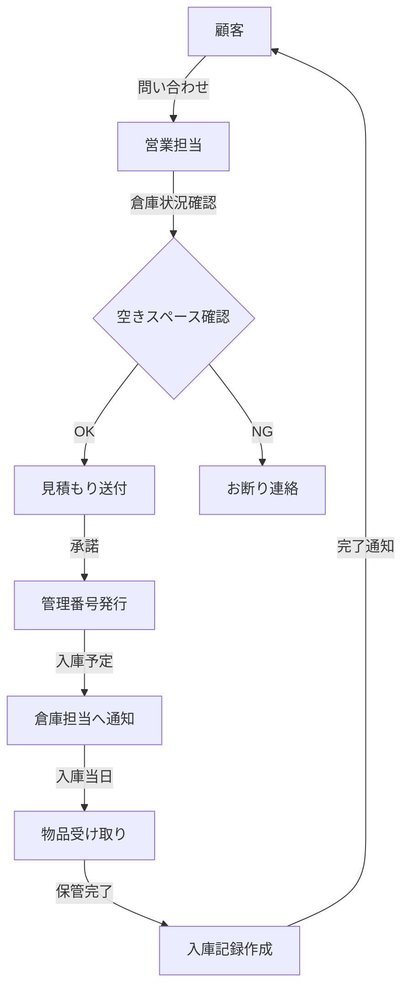

# 業務フロー図

## 1. 問い合わせから入庫までのフロー

```mermaid
flowchart TD
    A[顧客] -->|問い合わせ| B[営業担当]
    B -->|倉庫状況確認| C{空きスペース確認}
    C -->|OK| D[見積もり送付]
    C -->|NG| E[お断り連絡]
    D -->|承諾| F[管理番号発行]
    F -->|入庫予定| G[倉庫担当へ通知]
    G -->|入庫当日| H[物品受け取り]
    H -->|保管完了| I[入庫記録作成]
    I -->|完了通知| A
```