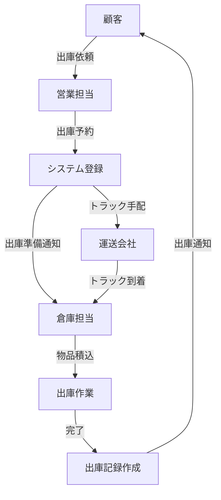

# 業務フロー図

## 2. 出庫フロー

```mermaid
flowchart TD
    A[顧客] -->|出庫依頼| B[営業担当]
    B -->|出庫予約| C[システム登録]
    C -->|トラック手配| D[運送会社]
    C -->|出庫準備通知| E[倉庫担当]
    D -->|トラック到着| E
    E -->|物品積込| F[出庫作業]
    F -->|完了| G[出庫記録作成]
    G -->|出庫通知| A
```
