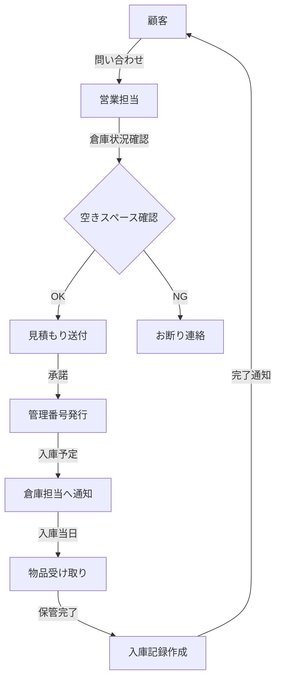
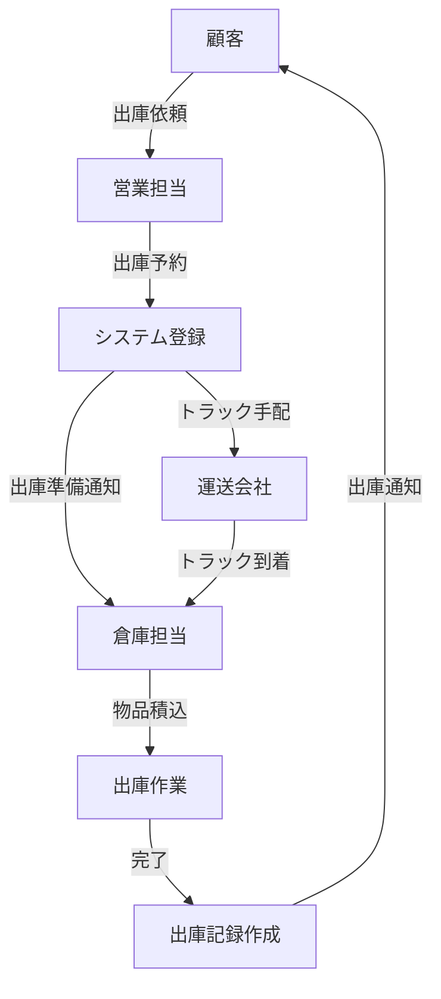
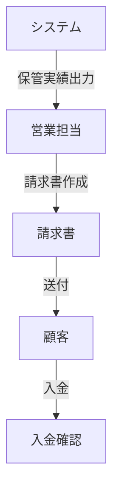
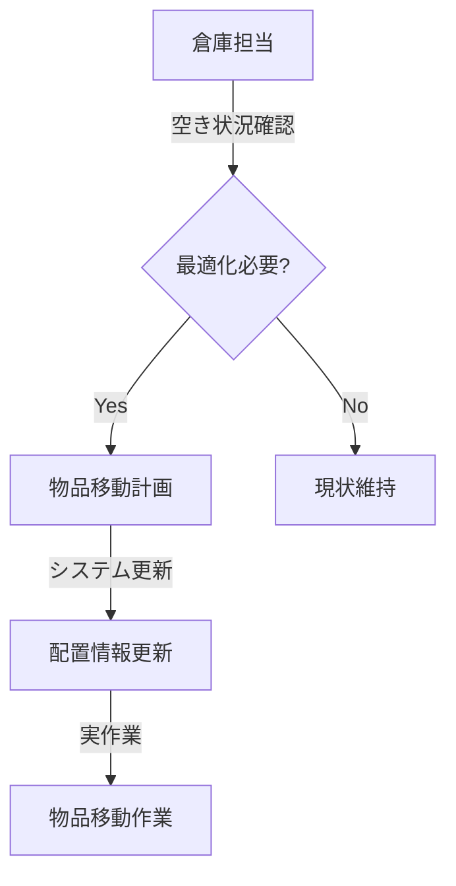

# 業務フロー図

## 1. 問い合わせから入庫までのフロー

```mermaid
flowchart TD
    A[顧客] -->|問い合わせ| B[営業担当]
    B -->|倉庫状況確認| C{空きスペース確認}
    C -->|OK| D[見積もり送付]
    C -->|NG| E[お断り連絡]
    D -->|承諾| F[管理番号発行]
    F -->|入庫予定| G[倉庫担当へ通知]
    G -->|入庫当日| H[物品受け取り]
    H -->|保管完了| I[入庫記録作成]
    I -->|完了通知| A
```

## 2. 出庫フロー

```mermaid
flowchart TD
    A[顧客] -->|出庫依頼| B[営業担当]
    B -->|出庫予約| C[システム登録]
    C -->|トラック手配| D[運送会社]
    C -->|出庫準備通知| E[倉庫担当]
    D -->|トラック到着| E
    E -->|物品積込| F[出庫作業]
    F -->|完了| G[出庫記録作成]
    G -->|出庫通知| A
```

## 3. 月次請求フロー

```mermaid
flowchart TD
    A[システム] -->|保管実績出力| B[営業担当]
    B -->|請求書作成| C[請求書]
    C -->|送付| D[顧客]
    D -->|入金| E[入金確認]
```

## 4. 倉庫管理フロー

```mermaid
flowchart TD
    A[倉庫担当] -->|空き状況確認| B{最適化必要?}
    B -->|Yes| C[物品移動計画]
    C -->|システム更新| D[配置情報更新]
    D -->|実作業| E[物品移動作業]
    B -->|No| F[現状維持]
```
