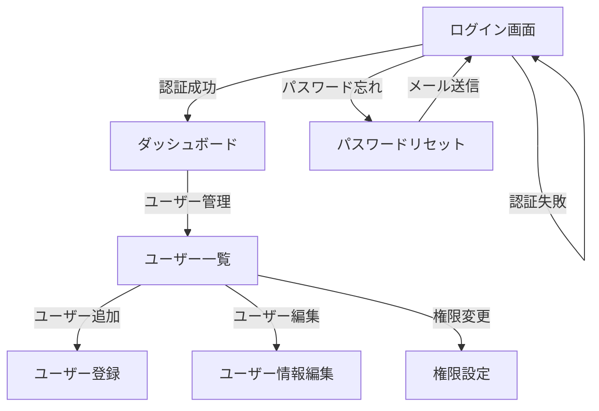
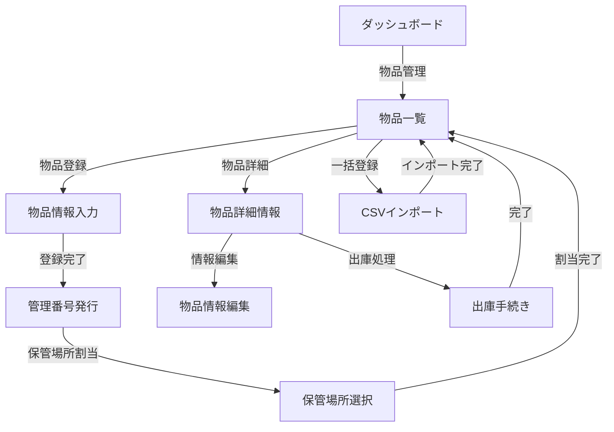
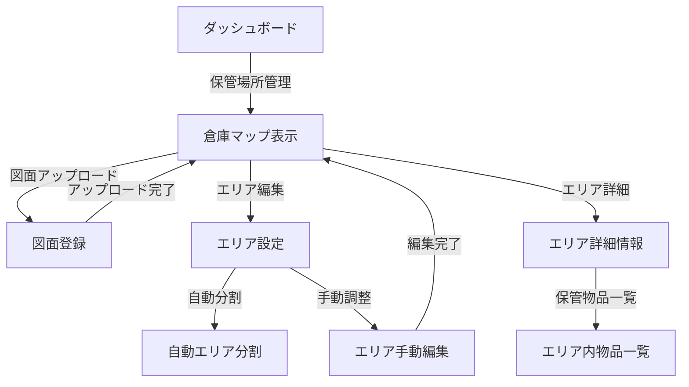
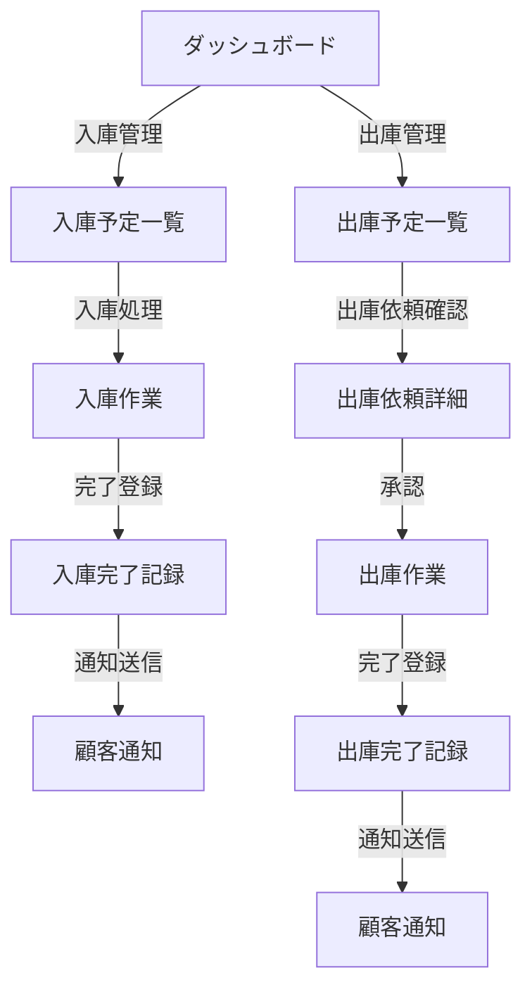
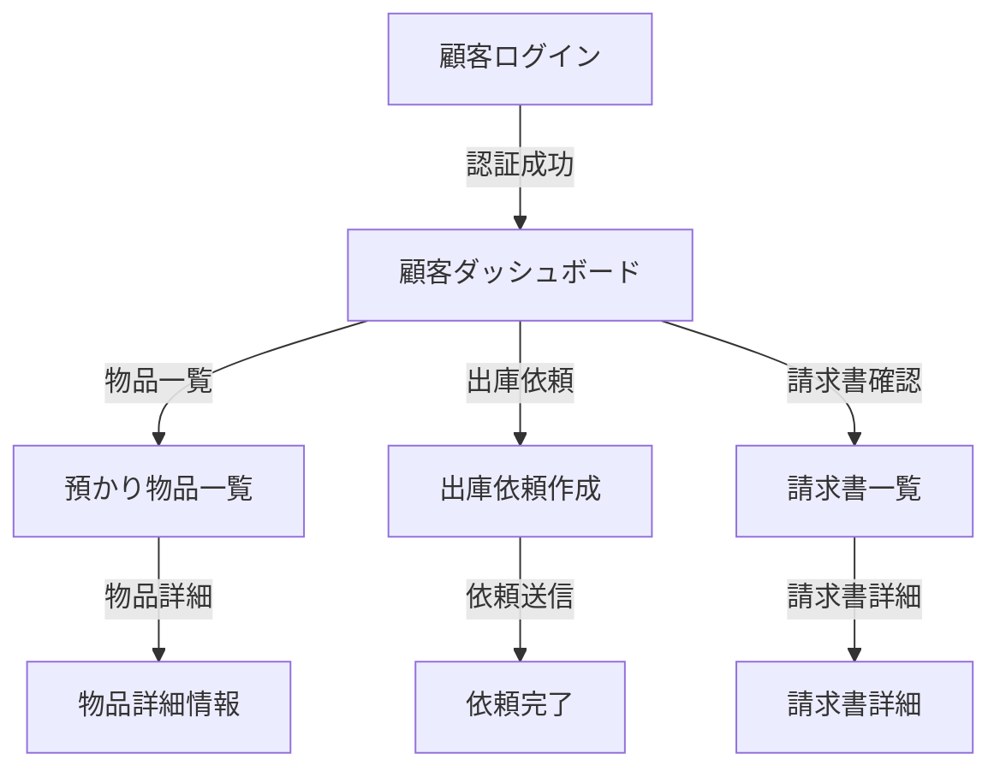
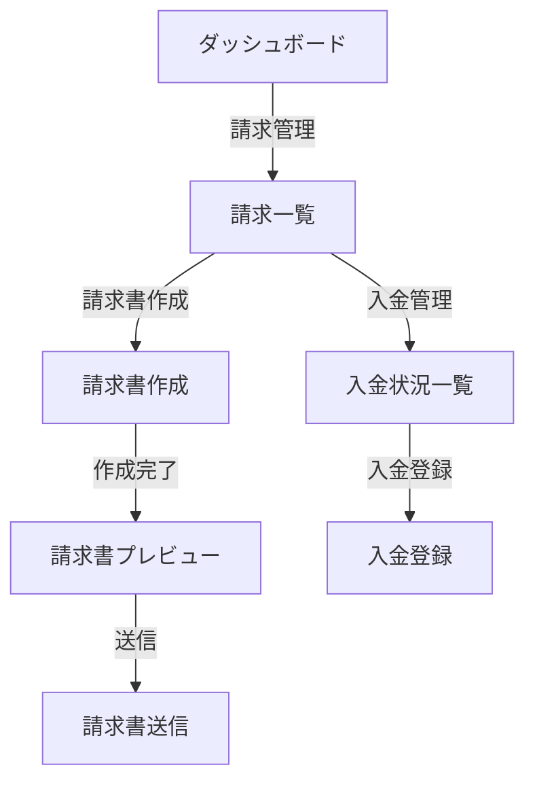
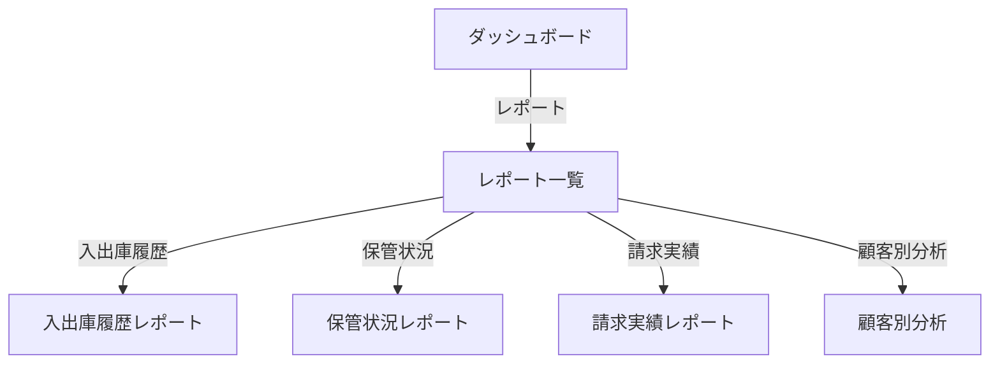

# 画面遷移図

本ドキュメントでは、要件定義書と業務フロー図に基づいた画面遷移図を示します。

## 1. ログイン・ユーザー管理系

```mermaid
flowchart TD
    A[ログイン画面] -->|認証成功| B[ダッシュボード]
    A -->|認証失敗| A
    A -->|パスワード忘れ| C[パスワードリセット]
    C -->|メール送信| A
    B -->|ユーザー管理| D[ユーザー一覧]
    D -->|ユーザー追加| E[ユーザー登録]
    D -->|ユーザー編集| F[ユーザー情報編集]
    D -->|権限変更| G[権限設定]
```

## 2. 物品管理系

```mermaid
flowchart TD
    A[ダッシュボード] -->|物品管理| B[物品一覧]
    B -->|物品登録| C[物品情報入力]
    C -->|登録完了| D[管理番号発行]
    D -->|保管場所割当| E[保管場所選択]
    E -->|割当完了| B
    B -->|物品詳細| F[物品詳細情報]
    F -->|情報編集| G[物品情報編集]
    F -->|出庫処理| H[出庫手続き]
    H -->|完了| B
    B -->|一括登録| I[CSVインポート]
    I -->|インポート完了| B
```

## 3. 保管場所管理系

```mermaid
flowchart TD
    A[ダッシュボード] -->|保管場所管理| B[倉庫マップ表示]
    B -->|図面アップロード| C[図面登録]
    C -->|アップロード完了| B
    B -->|エリア編集| D[エリア設定]
    D -->|自動分割| E[自動エリア分割]
    D -->|手動調整| F[エリア手動編集]
    F -->|編集完了| B
    B -->|エリア詳細| G[エリア詳細情報]
    G -->|保管物品一覧| H[エリア内物品一覧]
```

## 4. 入出庫管理系

```mermaid
flowchart TD
    A[ダッシュボード] -->|入庫管理| B[入庫予定一覧]
    B -->|入庫処理| C[入庫作業]
    C -->|完了登録| D[入庫完了記録]
    D -->|通知送信| E[顧客通知]
    A -->|出庫管理| F[出庫予定一覧]
    F -->|出庫依頼確認| G[出庫依頼詳細]
    G -->|承認| H[出庫作業]
    H -->|完了登録| I[出庫完了記録]
    I -->|通知送信| J[顧客通知]
```

## 5. 顧客向け画面系

```mermaid
flowchart TD
    A[顧客ログイン] -->|認証成功| B[顧客ダッシュボード]
    B -->|物品一覧| C[預かり物品一覧]
    C -->|物品詳細| D[物品詳細情報]
    B -->|出庫依頼| E[出庫依頼作成]
    E -->|依頼送信| F[依頼完了]
    B -->|請求書確認| G[請求書一覧]
    G -->|請求書詳細| H[請求書詳細]
```

## 6. 請求管理系

```mermaid
flowchart TD
    A[ダッシュボード] -->|請求管理| B[請求一覧]
    B -->|請求書作成| C[請求書作成]
    C -->|作成完了| D[請求書プレビュー]
    D -->|送信| E[請求書送信]
    B -->|入金管理| F[入金状況一覧]
    F -->|入金登録| G[入金登録]
```

## 7. レポート・分析系

```mermaid
flowchart TD
    A[ダッシュボード] -->|レポート| B[レポート一覧]
    B -->|入出庫履歴| C[入出庫履歴レポート]
    B -->|保管状況| D[保管状況レポート]
    B -->|請求実績| E[請求実績レポート]
    B -->|顧客別分析| F[顧客別分析]
```
